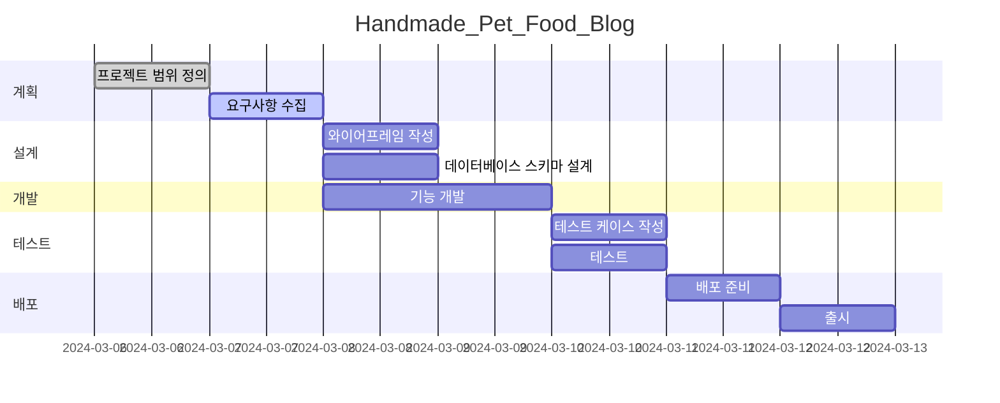

# Handmade_Pet_Food blog

* 목표
    * 수제 펫푸드 기록 및 소통용 블로그
    * 로그인 유저는 자신이 제작 및 급여한 수제 펫푸드 사진들을 업로드할 수 있음
    * 로그인 유저는 타 유저의 게시글에 댓글 및 대댓글을 달면서 서로 정보를 공유할 수 있음

* 사용방법
    1. 자신의 아이디-비밀번호를 입력하여, 로그인하세요.
    2. 자신이 제작하거나 급여한 수제 펫푸드 사진들 및 후기들을 기록하세요.
    3. 타 유저들과 댓글 및 대댓글 기능을 통해서 활발하게 소통해보세요.

* 서비스 URL 정보
    * blog github repo: https://github.com/najasinis/Handmade_Pet_Food_Blog

* 기존 타 블로그들과의 비교
    * 필러링된 로그인 유저들만 사용 가능
        * 수제 펫푸드에 관심이 많은 유저들과의 원활한 소통 가능
        * 수제 펫푸드 정보들의 획득 용이성
    * 댓글 및 대댓글
        * 상호 소통이 원활하게 되면서 수제 펫푸드 정보 뿐만 아니라, 펫 양육 지식 또한 획득 가능
     
* ERD
  

* 폴더 트리

    | 폴더명 | 파일명 | 함수 | 변수 | 비고 |
    |--------|--------|------|------|------|
    | style  | globalStyle.js | | | 전역 스타일 설정 |
    | style  | blogContentsStyle.js | | | 블로그 컨텐츠 스타일 설정 |
    | JS     | config.js | | siteConfig | 사이트 설정 정보 |
    | JS     | URLparsing.js | extractFromUrl() | url(url obj), pathParts(쿼리스트링), isLocal | URL 파싱, 스키마 확인 |
    | JS     | render.js | renderBlogPosts(), renderMenu() | | 데이터를 DOM에 렌더링 |
    | JS     | initData.js | initDataBlogList(), initDataBlogMenu() | blogList, blogMenu | 초기 데이터 로딩, 스키마 확인 |

* WBS


* 화면 정의서
    <table>
        <tr>
            <th>메인화면</th>
            <th>설명</th>
        </tr>
        <tr>
            <td width="70%">
                
            </td>
            <td>
                <ul>
                    <li>목록 필요</li>
                    <li>URL 파싱 및 URL 변경 필요</li>
                    <li>목록을 6개씩 잘라내어 넘어가게 하거나 무한스크롤 구현</li>
                    <li>가장 최신의 게시물을 맨 위에 게시</li>
                </ul>
            </td>
        </tr>
    </table>
    <table>
        <tr>
            <th>포스트 화면</th>
            <th>설명</th>
        </tr>
        <tr width="70%">
            <td width="70%">
                
            </td>
            <td>
                <ul>
                    <li>목록을 불러오는 것이 불필요 하지만 검색 버튼을 눌렀을 경우 목록을 불러올 필요가 있음</li>
                    <li>URL 파싱 및 URL 변경 필요</li>
                    <li>posts 변수에 담아 다른 페이지 이동 후 재접속 할 때 다시 통신하지 않게 처리</li>
                </ul>
            </td>
        </tr>
    </table>
    <table>
        <tr>
            <th>그 외 메뉴 화면</th>
            <th>설명</th>
        </tr>
        <tr>
            <td width="70%">
                
            </td>
            <td>
                <ul>
                    <li>목록을 불러오는 것이 불필요 하지만 검색 버튼을 눌렀을 경우 목록을 불러올 필요가 있음</li>
                    <li>URL 파싱 및 URL 변경 필요</li>
                </ul>
            </td>
        </tr>
    </table>

* 과업
    * 블로그 figma style 반영
    * pandas의 dateframe은 테이블로 표시되지 않는 사이드 이펙트 해결
    * user 정보 입력
        * default는 config
        * 다른 분들과 함께 집필할 때에는 호출하게
    * 'blog.md'파일을 어떻게 할지 의사결정 필요
    * 조회수
    * disqus 댓글
    * 한국어 가이드, 영어 가이드
    * GitHub 스폰서 등록(위니브 계정으로 이관 후)

* 애러와 애러 해결(트러블슈팅 히스토리)
    * 모바일 메뉴 설계
        * 모바일 메뉴와 데스스탑 메뉴를 2개 만드는 일을 이벤트 위임을 통해 해결해야 했으나 중복코드가 발생하더라도 시간을 절약하는 차원에서 모듈화 하지 않음.
    * API 호출 최소화
        * API 호출을 최소화 하여 하루 200번의 호출을 아낄 수 있도록 코드를 짜다보니 많은 부분에서 모듈화가 과하게 들어감. 구조가 다소 복잡해짐.
    * 사용자의 사용 복잡도
        * 만약 local_blogList.json을 사용자가 작성할 수 있다면 API 호출이 필요 없음. 이것을 가능하게 하는 코드는 프로젝트 흥행과 더불어 진행.
        * 또는 사용자가 이것을 선택할 수 있는 옵션 설정
    * 로컬에서 제대로 작동하지만 배포해서는 작동하지 않는 이슈가 있음. 아직 미해결.
        * URLpasing이 잘못되었다는 것을 확인. local에서는 origin에 port 붙이고 뒤에 쿼리스트링을 붙였고 github에서는 `https://paullabkorea.github.io/github_blog/`구조인데 `https://paullabkorea.github.io/`로 파싱되어 `https://paullabkorea.github.io/?menu=about`식으로 저장되고 있었음.
        * `new URL(window.location.href)`와 `new URL('https://paullabkorea.github.io/github_blog/?menu=about')`를 테스트하여 서버에서도 동작하도록 수정
    * `https://paullabkorea.github.io/github_blog/?post=%5B20240122%5D_%5BAI%EA%B0%80+IT+%EC%97%85%EA%B3%84%EC%99%80+%EA%B5%90%EC%9C%A1%EC%97%90+%EA%B0%80%EC%A0%B8%EC%98%A8+%EA%B2%83%5D_%5BAI%5D_%5B%EB%B9%8C%EA%B2%8C%EC%9D%B4%EC%B8%A0_%EC%83%98%EC%95%8C%ED%8A%B8%EB%A8%BC.jpg%5D_%5B%EB%B9%8C+%EA%B2%8C%EC%9D%B4%EC%B8%A0%EC%99%80+%EC%83%98+%EC%95%8C%ED%8A%B8%EB%A8%BC%EC%9D%98+%EB%8C%80%ED%99%94+%EC%A4%91+AI%EC%97%90+%EC%97%AD%ED%95%A0%EC%97%90+%EB%8C%80%ED%95%B4%5D.md` 로 접속시 `https://paullabkorea.github.io/github_blog/?post=undefined`로 URL이 변경되는 케이스 발견
        * URL 변경을 origin 기준이 아니라 href에서 host + repo 이름으로 변경
    * 주피터노트북 변환에서 ipynb 파일 안에 code가 `f'<h1>hello</h1>'`으로 되어 있으면 h1으로 해석되는 경우가 생김
        * map이나 filter 변환에도 같은 이슈가 있어서 코드블록은 엔티티 코드로 변환
        * (해결중) 이렇게 해결하니 pandas의 dateframe은 테이블로 표시되지 않는 사이드 이펙트 발생
    * ipynb에서 ul과 li 아래 p태그가 생겨 개행
        * `\n`을 별도로 처리
    * 검색창 이벤트 버블링
        * 아래 코드로 이벤트 버블링 해결
            ```javascript
            searchInput.onclick = (event) => {
                    event.stopPropagation();
                };
            ```
    * 검색기능 구현 후 UI가 깨지는 문제 발생
        * figma style이 나왔기 때문에 기존에 tailwind style만 유지
        * 계산했던 모든 style 제거

* 활용한 언어 및 툴 정리
    * Python
    * HTML/CSS/JS
    * Django
    * 노션
    * Git
    * VS code
